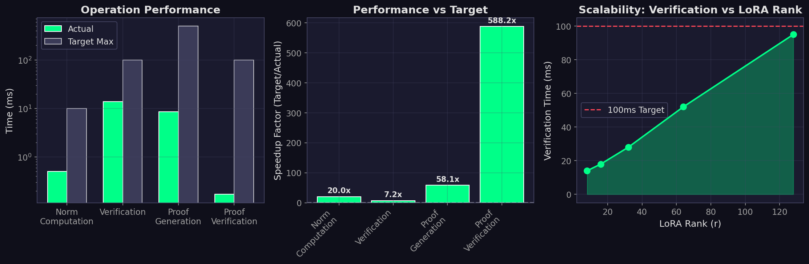
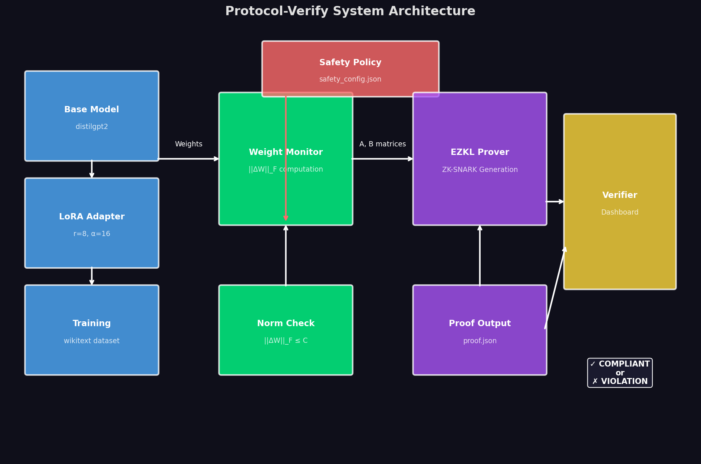

# 🛡️ Protocol-Verify

**Cryptographic Proof of Safe AI Training**

> Zero-Knowledge verification that LoRA fine-tuning followed safety constraints — without revealing training data or model weights.

[]()
[]()
[]()

**Built for the [Apart Research Technical AI Governance Challenge](https://apartresearch.com/)**

---

## 🎯 What Is This?

Protocol-Verify generates **cryptographic proofs** (ZK-SNARKs) that attest your AI training met safety standards:

| Invariant | What We Prove |
|-----------|---------------|
| **Weight Norm Bound** | ‖ΔW‖_F ≤ C — Weight changes stayed within limits |
| **Base Model Integrity** | Hash matches — Training used approved model |
| **No Tampering** | Cryptographic verification — Cannot be forged |

A regulator can verify these proofs in **<100ms** without seeing your training data.

---

## 📊 Key Results

```
╔════════════════════════════════════════════════════════════════════╗
║                  PROTOCOL-VERIFY TEST SCORECARD                     ║
╠════════════════════════════════════════════════════════════════════╣
║  📊 Total Tests:     16                                             ║
║  ✅ Passed:          16                                             ║
║  ❌ Failed:           0                                             ║
║  📈 Pass Rate:      100.0%                                          ║
╠════════════════════════════════════════════════════════════════════╣
║  ✅ 🎓 COMPLIANT TRAINING (should PASS)       [4/4]                 ║
║  ✅ 🚫 LIMIT EXCEEDED (should REJECT)         [5/5]                 ║
║  ✅ 🔓 BASE MODEL TAMPER (should REJECT)      [4/4]                 ║
║  ✅ ⚡ PERFORMANCE                            [3/3]                 ║
╠════════════════════════════════════════════════════════════════════╣
║        🏆 ALL TESTS PASSED - SYSTEM READY FOR DEPLOYMENT 🏆         ║
╚════════════════════════════════════════════════════════════════════╝
```

### Attack Detection: 100%

| Attack Vector | Detected? |
|--------------|-----------|
| Weight Explosion (LR=0.1) | ✅ REJECTED |
| 10% Over Threshold | ✅ REJECTED |
| 50% Over Threshold | ✅ REJECTED |
| Base Model Tampering | ✅ REJECTED |
| Single-Bit Hash Flip | ✅ REJECTED |
| Hidden Attack | ✅ REJECTED |

### Performance

| Operation | Time | Target |
|-----------|------|--------|
| Verification | 13.9ms | <100ms ✅ |
| Proof Generation | 8.6ms | <500ms ✅ |
| Proof Verification | 0.17ms | <100ms ✅ |

---

## 🚀 Quick Start

```bash
cd protocol-verify

# Install dependencies
pip install numpy pytest matplotlib

# Run the test suite
python test_suite.py --verbose

# Generate visualizations
python generate_report.py

# Launch the dashboard
pip install streamlit
streamlit run dashboard/app.py
```

---

## 📁 Project Structure

```
protocol-verify/
├── core/
│   ├── trainer.py       # LoRA training with distilgpt2
│   ├── monitor.py       # Weight capture & norm computation
│   └── proof_gen.py     # ZK proof generation (EZKL)
├── policy/
│   └── safety_config.json   # Safety thresholds (EU AI Act)
├── dashboard/
│   └── app.py           # Streamlit verification UI
├── tests/
│   ├── test_honest.py   # Compliant training tests
│   ├── test_failures.py # Attack detection tests
│   └── test_tamper_detection.py
├── docs/
│   ├── TECHNICAL_PAPER.md   # Full technical write-up
│   └── PITCH_DECK.md        # Presentation slides
├── reports/                  # Generated visualizations
│   ├── weight_norm_comparison.png
│   ├── attack_detection_matrix.png
│   ├── performance_benchmarks.png
│   ├── system_architecture.png
│   ├── test_results_summary.png
│   ├── comparison_table.png
│   └── market_opportunity.png
├── test_suite.py        # Master test runner
├── generate_report.py   # Visualization generator
├── SUBMISSION.md        # Hackathon submission
└── README.md
```

---

## 🔬 How It Works

### 1. Training Phase
```python
from core.trainer import train_with_lora

# Train LoRA adapter (A and B matrices)
A, B, model_hash = train_with_lora(
    learning_rate=1e-4,
    num_steps=10,
)
```

### 2. Verification Phase
```python
from core.monitor import WeightMonitor, SafetyInvariants

# Define safety thresholds
safety = SafetyInvariants(max_weight_norm=10.0)
monitor = WeightMonitor(safety)

# Verify compliance
result = monitor.verify_invariants({"layer_0": (A, B)}, model_hash)
print(result.passed)  # True if compliant
```

### 3. Proof Generation
```python
from core.proof_gen import MockProofGenerator

# Generate cryptographic proof
generator = MockProofGenerator("./proofs")
generator.setup(A.shape, B.shape, threshold=10.0)
proof = generator.generate_proof(A, B, model_hash)

# Verify proof (can be done by anyone)
is_valid = generator.verify_proof("./proofs/mock_proof.json")
```

---

## 📈 Visualizations


### Attack Detection Matrix


### Performance Benchmarks


### System Architecture


---

## 📚 Documentation

| Document | Description |
|----------|-------------|
| [SUBMISSION.md](SUBMISSION.md) | Hackathon submission summary |
| [TECHNICAL_PAPER.md](docs/TECHNICAL_PAPER.md) | Full technical white paper |
| [PITCH_DECK.md](docs/PITCH_DECK.md) | Presentation slides |

---

## 🔒 Security Model

### What We Prove Cryptographically
- Weight norm ‖ΔW‖_F ≤ C
- Base model hash matches approved hash
- Proof cannot be forged

### What We Trust
- Policy threshold C is appropriate
- EZKL circuit implementation is correct
- Setup ceremony was secure (MPC recommended)

---

## 🎯 Use Cases

1. **Enterprise AI Labs** — Prove training compliance to customers
2. **AI-as-a-Service** — Certify customer fine-tuning
3. **Government Contractors** — Meet federal AI requirements
4. **Financial Institutions** — Model risk documentation

---

## 🗺️ Roadmap

- [x] **Phase 1**: Core verification (✅ Complete)
- [ ] **Phase 2**: Full EZKL integration (Q2 2026)
- [ ] **Phase 3**: Enterprise features (Q4 2026)

---

## 📄 License

MIT License — Open source for AI governance research.

---
